# 1.3. Flow chức năng cơ bản EDUMEE

Tài liệu này trình bày workflow theo từng vai trò sử dụng hệ thống. Cách viết ưu tiên góc nhìn nghiệp vụ: người dùng nhìn thấy gì, thao tác gì, hệ thống phản hồi ra sao và trạng thái tiếp theo là gì. Các API/màn hình chỉ được ghi ngắn ở cuối từng mục để đội kỹ thuật dễ đối chiếu.

Các vai trò chính trong codebase hiện tại:

- **Người dùng:** tài khoản `user`, sử dụng nền tảng để định hướng nghề nghiệp, làm bài test, xem lộ trình, tham gia cộng đồng và đặt lịch mentor.
- **Mentor:** tài khoản `mentor`, quản lý hồ sơ mentor, lịch rảnh, booking, buổi gọi và đánh giá.
- **Admin:** tài khoản `admin`, giám sát và quản trị toàn hệ thống.
- **Mobile user:** phiên bản mobile hiện mới hỗ trợ một phần luồng người dùng.

---

## Luồng Người dùng

Người dùng sử dụng EDUMEE để tạo tài khoản, hoàn thiện hồ sơ, làm bài đánh giá định hướng nghề nghiệp, xem gợi ý nghề, tạo lộ trình học tập, tham gia cộng đồng và đặt lịch với mentor.

### 1. Đăng ký / Đăng nhập

Người dùng tạo tài khoản hoặc đăng nhập để sử dụng các chức năng chính của hệ thống.

- **Đăng ký tài khoản mới:**
  - Người dùng truy cập trang đăng ký.
  - Nhập họ tên, email, mật khẩu, xác nhận mật khẩu và thông tin liên hệ.
  - Hệ thống kiểm tra dữ liệu hợp lệ, email trùng và độ mạnh mật khẩu.
  - Nếu hợp lệ, hệ thống tạo tài khoản, mã hóa mật khẩu và lưu vào cơ sở dữ liệu.
  - Người dùng được điều hướng về đăng nhập hoặc tiếp tục theo luồng xác thực email nếu hệ thống yêu cầu.

- **Đăng nhập tài khoản:**
  - Người dùng truy cập trang đăng nhập.
  - Nhập email và mật khẩu.
  - Hệ thống xác thực tài khoản và trả phiên đăng nhập.
  - Frontend lưu token, role và trạng thái onboarding.
  - Hệ thống tự điều hướng người dùng tới bước tiếp theo phù hợp.

- **Điều hướng sau đăng nhập:**
  - Nếu thiếu thông tin hồ sơ tối thiểu: chuyển tới màn hình hoàn thiện hồ sơ.
  - Nếu đã có hồ sơ nhưng chưa onboarding: chuyển tới màn hình onboarding.
  - Nếu đã hoàn tất các bước bắt buộc: chuyển tới dashboard.
  - Nếu tài khoản là mentor: chuyển tới cổng mentor.

- **Đăng nhập Google:**
  - Người dùng chọn đăng nhập Google.
  - Hệ thống chuyển sang Google OAuth.
  - Sau khi Google xác thực, backend tạo hoặc tìm tài khoản tương ứng.
  - Frontend nhận token tại trang OAuth success và tiếp tục điều hướng như đăng nhập thường.

**Màn hình/API tham chiếu:** `/register`, `/login`, `/oauth-success`; `POST /auth/register`, `POST /auth/login`, `GET /auth/google`, `GET /auth/google/callback`.

### 2. Quên mật khẩu

Người dùng có thể yêu cầu đặt lại mật khẩu khi không đăng nhập được.

- Người dùng mở trang quên mật khẩu.
- Nhập email đã đăng ký.
- Hệ thống kiểm tra email và gửi link/token đặt lại mật khẩu.
- Người dùng mở link reset.
- Nhập mật khẩu mới và xác nhận.
- Hệ thống kiểm tra token reset còn hợp lệ.
- Nếu hợp lệ, mật khẩu được cập nhật.
- Người dùng quay lại trang đăng nhập để sử dụng mật khẩu mới.

**Màn hình/API tham chiếu:** `/forgot-password`, `/reset-password`; `POST /auth/forgot-password`, `POST /auth/verify-forgot-password-token`, `POST /auth/reset-password`.

### 3. Hoàn thiện hồ sơ cá nhân

Sau khi đăng nhập, người dùng phải có hồ sơ tối thiểu trước khi dùng các chức năng chính.

- Hệ thống kiểm tra thông tin tài khoản hiện tại.
- Nếu thiếu tên, số điện thoại, ngày sinh hoặc trình độ học vấn, người dùng được chuyển tới trang hoàn thiện hồ sơ.
- Người dùng nhập thông tin cá nhân, học vấn, mục tiêu và sở thích học tập.
- Người dùng có thể cập nhật avatar trong trang hồ sơ.
- Hệ thống lưu thông tin vào tài khoản và hồ sơ người dùng.
- Sau khi hồ sơ đủ điều kiện, người dùng được chuyển sang onboarding hoặc dashboard.

**Màn hình/API tham chiếu:** `/complete-profile`, `/profile`; `GET /users/me`, `PATCH /users/me`, `PATCH /users/me/avatar`, `GET /profiles/my-profile`, `POST /profiles`, `PUT /profiles/my-profile`.

### 4. Onboarding định hướng ban đầu

Onboarding giúp hệ thống thu thập bối cảnh ban đầu trước khi cá nhân hóa trải nghiệm.

- Người dùng đã hoàn thiện hồ sơ nhưng chưa onboarding sẽ được đưa tới trang onboarding.
- Người dùng trả lời các câu hỏi định hướng ban đầu.
- Hệ thống lưu tiến độ từng bước.
- Khi hoàn thành, hệ thống đánh dấu onboarding completed.
- Người dùng tiếp tục sang bài test tính cách/nghề nghiệp hoặc vào dashboard.

**Màn hình/API tham chiếu:** `/onboarding`; `POST /onboarding-sessions`, `GET /onboarding-sessions/my`, `PUT /onboarding-sessions/:id/progress`, `PUT /onboarding-sessions/:id/complete`.

### 5. Làm bài test định hướng nghề nghiệp

Đây là luồng cốt lõi giúp hệ thống hiểu đặc điểm cá nhân và gợi ý nghề phù hợp.

- Người dùng mở bài test.
- Hệ thống tạo một phiên làm bài mới.
- Hệ thống tải danh sách câu hỏi đang hoạt động.
- Người dùng trả lời từng câu hỏi theo lựa chọn được hiển thị.
- Khi hoàn thành, người dùng nộp bài.
- Hệ thống lưu toàn bộ câu trả lời vào phiên làm bài.
- Hệ thống tạo phân tích AI dựa trên câu trả lời.
- Hệ thống kết thúc phiên làm bài.
- Người dùng được đưa tới trang kết quả.

**Trạng thái chính:**

- Đang làm bài.
- Đã hoàn thành.
- Đã hủy hoặc phiên không còn hợp lệ.

**Màn hình/API tham chiếu:** `/personality-test`, `/assessment-result`; `POST /assessment-sessions`, `GET /assessment-questions`, `POST /assessment-answers/bulk`, `POST /career-fit-results/generate-my-analysis`, `POST /assessment-sessions/:id/finish`.

### 6. Xem kết quả định hướng và nghề phù hợp

Sau khi làm test, người dùng xem kết quả phân tích và các nghề được đề xuất.

- Người dùng mở trang kết quả.
- Hệ thống lấy kết quả phân tích gần nhất của người dùng.
- Màn hình hiển thị nhóm tính cách, điểm phù hợp và danh sách nghề đề xuất.
- Người dùng có thể xem top matches.
- Người dùng có thể đi tiếp sang phân tích nghề, so sánh nghề hoặc tạo lộ trình học.

**Màn hình/API tham chiếu:** `/assessment-result`, `/career-analysis`; `GET /career-fit-results/my-results`, `GET /career-fit-results/top-matches`, `GET /career-fit-results/insights`, `GET /career-fit-results/detailed-analysis`.

### 7. Khám phá nghề nghiệp

Người dùng có thể chủ động xem danh sách nghề và tìm nghề phù hợp với sở thích.

- Người dùng mở trang khám phá nghề.
- Hệ thống hiển thị danh sách career hiện có.
- Người dùng tìm kiếm theo tên nghề.
- Người dùng lọc theo danh mục, kỹ năng hoặc xu hướng.
- Người dùng chọn một nghề để xem thông tin chi tiết.
- Hệ thống hiển thị mô tả nghề, kỹ năng cần có, mức lương, xu hướng thị trường, ưu điểm và thách thức.
- Người dùng có thể xem các nghề liên quan.

**Màn hình/API tham chiếu:** `/specialization`; `GET /careers`, `GET /careers/search`, `GET /careers/categories`, `GET /careers/:id`, `GET /careers/:id/related`.

### 8. So sánh nghề nghiệp

Người dùng so sánh nhiều nghề để ra quyết định tốt hơn.

- Người dùng mở trang so sánh nghề.
- Chọn từ hai nghề trở lên.
- Hệ thống lấy dữ liệu career và tạo bảng so sánh.
- Người dùng xem khác biệt về kỹ năng, cơ hội, thu nhập, thị trường và mức độ phù hợp.
- Người dùng có thể yêu cầu phân tích chi tiết bằng AI.
- Hệ thống lưu lịch sử so sánh của người dùng.

**Màn hình/API tham chiếu:** `/career-compare`; `POST /career-comparisons/compare-careers`, `POST /career-comparisons/detailed-analysis`, `GET /career-comparisons/my-comparisons`.

### 9. Tạo lộ trình học tập

Người dùng tạo roadmap cá nhân để biết nên học gì theo từng giai đoạn.

- Người dùng mở trang lộ trình học.
- Chọn career mục tiêu hoặc đi từ trang phân tích nghề.
- Yêu cầu hệ thống tạo roadmap bằng AI.
- Hệ thống kiểm tra quyền sử dụng tính năng và quota gói AI.
- AI tạo lộ trình gồm các phase, kỹ năng, hoạt động học tập và mốc tiến độ.
- Người dùng xem roadmap mới nhất.
- Người dùng cập nhật tiến độ học hoặc đánh dấu hoàn thành phase.

**Ghi chú hiện trạng:** Backend đã có API cho weekly plan, checkpoint và task submission, nhưng UI web hiện chủ yếu tập trung vào roadmap.

**Màn hình/API tham chiếu:** `/learning-roadmap`; `POST /learning-roadmaps/generate-ai`, `GET /learning-roadmaps/latest`, `PUT /learning-roadmaps/:id/progress`, `PUT /learning-roadmaps/:id/phase/:phaseId/complete`.

### 10. Mô phỏng nghề nghiệp

Người dùng trải nghiệm các tình huống mô phỏng để hiểu công việc thực tế.

- Người dùng mở trang mô phỏng nghề.
- Hệ thống lấy danh sách nghề phù hợp nhất với kết quả test.
- Người dùng chọn một nghề muốn trải nghiệm.
- Hệ thống lấy nội dung mô phỏng đã có hoặc sinh nội dung mới bằng AI.
- Màn hình hiển thị tình huống, cấp độ, nhiệm vụ và mô tả công việc.
- Người dùng đọc/làm theo kịch bản để hiểu môi trường làm việc.

**Màn hình/API tham chiếu:** `/career-simulation`; `GET /career-simulation/top-careers`, `GET /career-simulation/:careerTitle`.

### 11. Tham gia cộng đồng

Người dùng có thể xem, đăng bài, tương tác và báo cáo nội dung cộng đồng.

- **Xem bảng tin:**
  - Người dùng mở trang cộng đồng.
  - Hệ thống hiển thị danh sách bài viết.
  - Người dùng tìm kiếm theo nội dung hoặc lọc theo chuyên mục.
  - Người dùng xem hashtag nổi bật và top contributors.

- **Xem chi tiết bài viết:**
  - Người dùng chọn một bài viết.
  - Hệ thống hiển thị nội dung, tác giả, lượt thích và bình luận.

- **Tạo bài viết:**
  - Người dùng nhập tiêu đề, nội dung, danh mục và tag.
  - Hệ thống lưu bài viết và cập nhật lại danh sách.

- **Tương tác:**
  - Người dùng thích hoặc bỏ thích bài viết.
  - Người dùng bình luận vào bài viết.
  - Chủ nội dung hoặc admin có thể xóa nội dung khi cần.

- **Báo cáo vi phạm:**
  - Người dùng chọn report với bài viết hoặc bình luận không phù hợp.
  - Nhập lý do và mô tả.
  - Hệ thống tạo báo cáo để admin xử lý.

**Màn hình/API tham chiếu:** `/community`, `/community/[id]`; `GET /community-posts`, `POST /community-posts`, `POST /community-posts/:id/like`, `POST /community-posts/:id/comments`, `POST /community/reports`.

### 12. Tìm mentor và đặt lịch tư vấn

Người dùng đặt lịch với mentor để được tư vấn định hướng, kỹ năng, CV hoặc phỏng vấn.

- **Tìm mentor:**
  - Người dùng mở trang mentor matching.
  - Hệ thống hiển thị danh sách mentor active.
  - Người dùng tìm kiếm theo kỹ năng, chuyên môn, ngành hoặc công ty.
  - Người dùng xem hồ sơ mentor, giá, lịch rảnh và review công khai.

- **Tạo booking:**
  - Người dùng chọn mentor và slot phù hợp.
  - Chọn loại buổi tư vấn.
  - Nhập chủ đề muốn trao đổi, câu hỏi cụ thể và mục tiêu.
  - Hệ thống kiểm tra quota mentor booking.
  - Hệ thống tạo booking session.

- **Thanh toán booking:**
  - Nếu buổi tư vấn miễn phí, booking chuyển sang trạng thái chờ mentor xác nhận.
  - Nếu buổi tư vấn có phí, hệ thống tạo payment và đưa người dùng tới checkout.
  - Khi thanh toán thành công, booking được cập nhật để tiếp tục xử lý.

- **Theo dõi booking:**
  - Người dùng xem trạng thái booking.
  - Có thể nhắn tin trong booking.
  - Có thể nhận đề xuất đổi lịch hoặc phản hồi đề xuất đổi lịch.
  - Sau buổi tư vấn, người dùng gửi đánh giá mentor.

**Trạng thái booking chính:** chờ thanh toán, chờ xác nhận, đã xác nhận, đã đổi lịch, đã hoàn thành, hủy bởi người học, hủy bởi mentor.

**Màn hình/API tham chiếu:** `/mentor-matching`, `/mentor-call/[meetingCode]`; `GET /tutor-profiles/active`, `GET /mentor-availability/mentor/:mentorId/available`, `POST /booking-sessions`, `POST /payments/mentor-booking/purchase`, `POST /session-reviews`.

### 13. Quản lý ví và lịch sử thanh toán

Người dùng theo dõi số dư Edumee Credit và các giao dịch liên quan.

- Người dùng mở trang ví.
- Hệ thống hiển thị số dư hiện tại.
- Người dùng xem lịch sử giao dịch.
- Giao dịch có thể là cộng tiền, trừ tiền, hoàn tiền, giữ tiền hoặc giải phóng tiền giữ.
- Khi người dùng dùng credit để thanh toán, hệ thống có thể giữ tiền trước.
- Nếu giao dịch thành công, khoản giữ được ghi nhận.
- Nếu hủy hoặc refund, khoản tiền được hoàn hoặc giải phóng.

**Màn hình/API tham chiếu:** `/wallet`; `GET /wallet/me`, `GET /wallet/me/transactions`.

---

## Luồng Admin (Tổng quan)

Admin có quyền giám sát toàn hệ thống, quản lý người dùng, nghề nghiệp, ngân hàng câu hỏi, mentor, cộng đồng, giao dịch, gói AI, analytics và audit log.

### 1. Tổng quan hệ thống (Dashboard)

Bảng điều khiển trung tâm hiển thị các chỉ số vận hành chính của nền tảng.

- **Thống kê nhanh:**
  - Tổng số người dùng.
  - Số người dùng mới.
  - Số lượt làm assessment.
  - Doanh thu hoặc giao dịch phát sinh.
  - Hoạt động gần đây.

- **Biểu đồ và xu hướng:**
  - Tăng trưởng người dùng theo thời gian.
  - Hoạt động assessment.
  - Doanh thu hoặc payment theo kỳ.
  - Các chỉ số tracking/event.

- **Điều hướng quản trị:**
  - Từ dashboard, admin đi nhanh tới quản lý người dùng, careers, mentor, cộng đồng, tài chính, analytics và audit logs.

**Màn hình/API tham chiếu:** `/admin/dashboard`; `GET /admin/dashboard-stats`.

### 2. Quản lý người dùng

Admin quản lý danh sách tài khoản và xử lý các tài khoản vi phạm.

#### 2.1. Danh sách người dùng

- Xem danh sách tất cả người dùng.
- Phân loại theo vai trò: user, mentor, admin.
- Hiển thị thông tin cơ bản: tên, email, số điện thoại, role, ngày tạo, trạng thái.
- Tìm kiếm theo tên hoặc email.
- Lọc theo role, trạng thái và các tiêu chí hỗ trợ.
- Phân trang danh sách.

#### 2.2. Chi tiết và trạng thái người dùng

- Xem hồ sơ cơ bản của người dùng.
- Cập nhật trạng thái hoạt động hoặc khóa tài khoản.
- Đổi role khi cần thiết.
- Xóa một người dùng.
- Xóa nhiều người dùng đã chọn.

**Màn hình/API tham chiếu:** `/admin/users`; `GET /admin/users`, `PATCH /admin/users/:id/status`, `PATCH /admin/users/:id/role`, `DELETE /admin/users/:id`, `DELETE /admin/users/bulk-delete`.

### 3. Quản lý nghề nghiệp

Admin quản lý kho dữ liệu nghề nghiệp dùng cho khám phá nghề, phân tích và gợi ý.

#### 3.1. Danh sách nghề nghiệp

- Xem tất cả nghề đang có trên hệ thống.
- Tìm kiếm theo tên nghề.
- Lọc theo danh mục, ngành, nhu cầu thị trường hoặc trạng thái dữ liệu.
- Xem thông tin như mô tả, kỹ năng, mức lương, xu hướng, ưu điểm, thách thức.

#### 3.2. Thêm nghề mới

- Admin nhập tên nghề và các thông tin mô tả.
- Có thể dùng AI để tạo dữ liệu ban đầu.
- Hệ thống kiểm tra trùng tên nghề trước khi tạo.
- Nghề mới được đưa vào kho career để user có thể khám phá.

#### 3.3. Chỉnh sửa và bổ sung dữ liệu

- Cập nhật mô tả, kỹ năng, mức lương, thị trường, pros/cons.
- Dùng chức năng fill missing để AI bổ sung các trường còn thiếu.
- Đồng bộ skill tags liên quan tới career.

#### 3.4. Xóa nghề

- Admin xóa nghề không còn phù hợp.
- Hệ thống gỡ dữ liệu nghề khỏi danh sách hiển thị.

**Màn hình/API tham chiếu:** `/admin/careers`; `GET /admin/careers`, `POST /admin/careers`, `PATCH /admin/careers/:id`, `DELETE /admin/careers/:id`, `POST /admin/careers/generate-ai`, `POST /admin/careers/:id/fill-missing`.

### 4. Quản lý ngân hàng câu hỏi assessment

Admin quản lý bộ câu hỏi dùng trong bài test định hướng.

- Xem danh sách câu hỏi hiện có.
- Tìm kiếm theo nội dung hoặc dimension.
- Thêm câu hỏi mới.
- Chọn dimension như Realistic, Investigative, Artistic, Social, Enterprising, Conventional hoặc nhóm Big Five.
- Nhập bốn lựa chọn A, B, C, D.
- Sắp xếp câu hỏi bằng thứ tự hiển thị.
- Chỉnh sửa câu hỏi khi nội dung cần cập nhật.
- Xóa câu hỏi không còn sử dụng.

**Màn hình/API tham chiếu:** `/admin/content`; `GET /assessment-questions`, `POST /assessment-questions`, `PATCH /assessment-questions/:id`, `DELETE /assessment-questions/:id`.

### 5. Quản lý mentor

Admin xét duyệt và giám sát mentor trên nền tảng.

#### 5.1. Xét duyệt hồ sơ mentor

- Xem danh sách hồ sơ mentor đang chờ duyệt.
- Xem thông tin chuyên môn, kỹ năng, công ty, giá tư vấn và mô tả.
- Phê duyệt hồ sơ để mentor hoạt động trên hệ thống.
- Từ chối hoặc tạm ngưng hồ sơ nếu không đạt yêu cầu.
- Khi hồ sơ được duyệt, tài khoản có thể được cập nhật role mentor.

#### 5.2. Danh sách mentor

- Xem mentor đang hoạt động.
- Tìm kiếm/lọc theo trạng thái, kỹ năng hoặc thông tin chuyên môn.
- Xem số booking, đánh giá và thông tin hồ sơ.

#### 5.3. Quản lý booking mentor

- Xem danh sách booking trên hệ thống.
- Lọc theo trạng thái booking.
- Theo dõi booking đang chờ, đã xác nhận, đã hoàn thành hoặc đã hủy.

**Màn hình/API tham chiếu:** `/admin/mentors`; `GET /tutor-profiles`, `GET /tutor-profiles/search`, `PUT /tutor-profiles/:id/status`, `GET /booking-sessions`.

### 6. Kiểm duyệt cộng đồng

Admin xử lý bài viết và báo cáo vi phạm trong cộng đồng.

#### 6.1. Danh sách bài viết

- Xem tất cả bài viết trong cộng đồng.
- Xem tác giả, tiêu đề, chuyên mục, số lượt thích, số bình luận và trạng thái.
- Xóa bài viết vi phạm hoặc không còn phù hợp.

#### 6.2. Danh sách báo cáo

- Xem các báo cáo đang chờ xử lý.
- Lọc theo loại đối tượng: bài viết hoặc bình luận.
- Xem lý do, mô tả và người báo cáo.
- Bỏ qua báo cáo nếu không hợp lệ.
- Xóa nội dung vi phạm và đánh dấu báo cáo đã xử lý.

#### 6.3. Review nghề nghiệp

- Xem đánh giá/review về nghề nghiệp.
- Xem vote và báo cáo liên quan đến review.
- Cập nhật trạng thái review/report khi cần.

**Màn hình/API tham chiếu:** `/admin/community`; `GET /community-posts`, `GET /community/reports/admin`, `PATCH /community/reports/admin/:id/status`, `DELETE /community-posts/:id`, `GET /career-reviews`.

### 7. Quản lý giao dịch và tài chính

Admin theo dõi payment, doanh thu và xử lý refund.

- Xem tổng quan tài chính theo khoảng thời gian.
- Xem danh sách giao dịch thanh toán.
- Xem chi tiết giao dịch: người thanh toán, số tiền, loại giao dịch, trạng thái, thời gian.
- Theo dõi doanh thu từ gói AI và booking mentor.
- Đồng bộ/đối soát trạng thái payment khi cần.
- Refund payment đã thanh toán.
- Khi refund, hệ thống ghi audit log và thu hồi entitlement liên quan nếu có.

**Màn hình/API tham chiếu:** `/admin/finance`; `GET /admin/finance/summary`, `GET /admin/finance/payments`, `POST /payments/:id/refund`, `POST /payments/webhooks/test`.

### 8. Quản lý gói AI

Admin tạo và vận hành các gói AI dùng để giới hạn quyền tính năng và quota.

- Xem danh sách gói hiện có.
- Thêm gói mới với tên, mô tả, giá, currency và chu kỳ.
- Cấu hình tính năng được bật trong gói.
- Cấu hình quota theo tháng hoặc lifetime.
- Chỉnh sửa thông tin gói.
- Xóa gói không còn sử dụng.
- Gán gói thủ công cho một người dùng bằng email, số điện thoại hoặc user identifier.

**Màn hình/API tham chiếu:** `/admin/plans`; `GET /ai-plans/admin`, `POST /ai-plans`, `PATCH /ai-plans/:id`, `DELETE /ai-plans/:id`, `POST /ai-subscriptions/admin/assign`.

### 9. Analytics và audit logs

Admin xem dữ liệu tracking và lịch sử hoạt động hệ thống.

- Xem chỉ số analytics tổng quan.
- Xem tracking events theo thời gian.
- Theo dõi page views và active visitors.
- Xem audit logs của các thao tác quan trọng.
- Xem activity logs hợp nhất để điều tra sự kiện.

**Màn hình/API tham chiếu:** `/admin/analytics`, `/admin/audit-logs`; `GET /admin/analytics`, `GET /admin/analytics/tracking-events`, `GET /admin/audit-logs`, `GET /admin/activity-logs`.

### 10. Cài đặt hệ thống

Admin có màn hình cấu hình hệ thống ở mức giao diện.

- Chỉnh thông tin hệ thống.
- Chỉnh tùy chọn thông báo.
- Chỉnh tùy chọn bảo mật.
- Chỉnh thông tin tích hợp.
- Lưu thay đổi vào localStorage demo.

**Tình trạng hiện tại:** `/admin/settings` là UI demo/local, chưa có backend settings workflow thật.

**Màn hình/API tham chiếu:** `/admin/settings`; chưa có API settings riêng trong backend hiện tại.

---

## Luồng Mentor

Mentor sử dụng EDUMEE để quản lý hồ sơ tư vấn, lịch rảnh, booking, tin nhắn, buổi gọi và đánh giá.

### 1. Xem tổng quan mentor

Màn hình tổng quan giúp mentor theo dõi hoạt động tư vấn.

- Xem thông tin nhanh về hồ sơ mentor.
- Xem booking gần đây hoặc lịch sắp tới.
- Xem trạng thái các yêu cầu tư vấn.
- Xem đánh giá và phản hồi từ người học.
- Điều hướng nhanh sang quản lý hồ sơ, lịch rảnh, booking và review.

**Màn hình/API tham chiếu:** `/mentor-dashboard`; `GET /booking-sessions/my`, `GET /tutor-profiles/me`, `GET /session-reviews/me/received`.

### 2. Đăng ký / cập nhật hồ sơ mentor

Người dùng có thể gửi hồ sơ để trở thành mentor; mentor đã duyệt có thể cập nhật hồ sơ.

- Nhập vị trí công việc, công ty, ngành nghề, kỹ năng chuyên môn.
- Nhập lĩnh vực hỗ trợ như CV, phỏng vấn, roadmap, project review.
- Cấu hình giá tư vấn, thời lượng và mô tả.
- Gửi hồ sơ cho hệ thống.
- Hồ sơ mới ở trạng thái chờ duyệt.
- Admin phê duyệt thì mentor được hoạt động.
- Mentor có thể cập nhật hồ sơ sau khi đã có profile.

**Màn hình/API tham chiếu:** `/mentor-dashboard/profile`, `/profile`; `POST /tutor-profiles`, `GET /tutor-profiles/me`, `PUT /tutor-profiles/:id`.

### 3. Quản lý lịch rảnh

Mentor thiết lập các khung giờ có thể nhận booking.

- Xem danh sách slot rảnh của mình.
- Tạo một slot rảnh thủ công.
- Tạo nhiều slot cùng lúc bằng bulk create.
- Cập nhật thời gian hoặc trạng thái slot.
- Xóa slot chưa được booking.
- Slot active sẽ hiển thị cho người dùng ở trang mentor matching.

**Màn hình/API tham chiếu:** `/mentor-dashboard/availability`; `GET /mentor-availability/me`, `POST /mentor-availability/slots`, `POST /mentor-availability/slots/bulk`, `PATCH /mentor-availability/slots/:id`, `DELETE /mentor-availability/slots/:id`.

### 4. Xác nhận lịch đặt

Mentor xử lý các booking được người dùng tạo.

- Xem danh sách booking theo vai trò mentor.
- Lọc hoặc quan sát booking theo trạng thái.
- Xem chi tiết booking: người học, chủ đề, câu hỏi, mục tiêu, thời gian yêu cầu.
- Xác nhận booking nếu có thể nhận lịch.
- Hủy booking nếu không thể nhận, kèm lý do.
- Khi xác nhận hoặc hủy, hệ thống gửi thông báo tới người liên quan.

**Màn hình/API tham chiếu:** `/mentor-dashboard/bookings`; `GET /booking-sessions/my`, `GET /booking-sessions/:id`, `POST /booking-sessions/:id/confirm`, `POST /booking-sessions/:id/cancel`.

### 5. Nhắn tin và đổi lịch booking

Mentor và người học có thể trao đổi trong booking trước buổi tư vấn.

- Gửi tin nhắn trong booking.
- Xem lịch sử trao đổi của booking.
- Tạo đề xuất đổi lịch khi thời gian cũ không phù hợp.
- Bên còn lại có thể chấp nhận hoặc từ chối đề xuất.
- Nếu chấp nhận, hệ thống cập nhật lịch, slot và trạng thái booking.
- Nếu từ chối, booking giữ lịch hiện tại.

**Màn hình/API tham chiếu:** `/mentor-dashboard/bookings`, `/mentor-matching`; `POST /booking-sessions/:id/messages`, `POST /booking-sessions/:id/reschedule-proposals`, `POST /booking-sessions/:id/reschedule-proposals/:proposalId/accept`, `POST /booking-sessions/:id/reschedule-proposals/:proposalId/decline`.

### 6. Tham gia buổi gọi mentor

Mentor tham gia phòng gọi tư vấn cùng người học.

- Đến giờ hẹn, mentor mở link phòng gọi.
- Hệ thống kiểm tra meeting code và quyền tham gia.
- Backend tạo LiveKit token.
- Mentor vào call room.
- Người học và mentor trao đổi trực tiếp trong buổi tư vấn.

**Màn hình/API tham chiếu:** `/mentor-call/[meetingCode]`; `GET /mentor-calls/:meetingCode`, `POST /mentor-calls/:meetingCode/token`.

### 7. Hoàn thành booking và xem đánh giá

Sau buổi tư vấn, mentor theo dõi đánh giá và trạng thái hoàn tất.

- Booking được đánh dấu hoàn thành.
- Hệ thống yêu cầu người học đánh giá mentor.
- Người học gửi rating và nhận xét.
- Mentor xem đánh giá đã nhận.
- Rating công khai của mentor được cập nhật.

**Màn hình/API tham chiếu:** `/mentor-dashboard/reviews`; `POST /booking-sessions/:id/complete`, `GET /session-reviews/me/received`, `GET /session-reviews/mentor/:mentorUserId/public`.

---

## Luồng Mobile hiện tại

Mobile app hiện là phiên bản rút gọn của luồng người dùng, tập trung vào đăng nhập/đăng ký và bài test Holland.

### 1. Đăng nhập / Đăng ký trên mobile

- Người dùng mở mobile app.
- App mặc định vào màn hình đăng nhập.
- Người dùng có thể đăng nhập bằng email/mật khẩu.
- Người dùng có thể chuyển sang đăng ký tài khoản mới.
- Token được lưu vào SecureStore trên native hoặc localStorage trên web.
- Các request sau đó tự gắn Authorization header.

**Màn hình/API tham chiếu:** mobile `/login`, `/register`; `POST /auth/login`, `POST /auth/register`.

### 2. Admin login trên mobile

- Người dùng mở màn hình admin login.
- Nhập email và mật khẩu admin.
- Hệ thống gọi API admin-login.
- Nếu đúng quyền admin, app cho vào khu vực tab hiện tại.

**Màn hình/API tham chiếu:** mobile `/admin-login`; `POST /auth/admin-login`.

### 3. Làm Holland test trên mobile

- Người dùng từ tab home chọn làm Holland test.
- App tạo assessment session.
- App tải danh sách câu hỏi.
- Người dùng trả lời từng câu.
- App gửi bulk answers.
- App yêu cầu backend generate analysis.
- App finish session.
- App chuyển sang màn hình kết quả.

**Màn hình/API tham chiếu:** mobile `/holland-test`, `/test-result`; `POST /assessment-sessions`, `GET /assessment-questions`, `POST /assessment-answers/bulk`, `POST /career-fit-results/generate-my-analysis`, `GET /career-fit-results/my-results`.

### 4. Giới hạn hiện tại của mobile

- Chưa có đầy đủ flow mentor.
- Chưa có payment/checkout.
- Chưa có community.
- Chưa có roadmap UI.
- Chưa có admin dashboard đầy đủ.
- API base hiện đang trỏ `localhost`, khi chạy trên thiết bị thật cần cấu hình lại host phù hợp.

---

## Luồng nền: thanh toán, ví, thông báo, tracking/audit

Các luồng này không phải lúc nào cũng là màn hình chính, nhưng hỗ trợ nhiều chức năng của hệ thống.

### 1. Thanh toán SePay

Thanh toán được dùng cho mua gói AI và booking mentor trả phí.

- Người dùng chọn mua gói hoặc booking có phí.
- Backend tạo payment pending.
- Hệ thống tạo checkout token và checkout URL.
- Người dùng mở trang checkout.
- Gateway SePay xử lý thanh toán.
- SePay gửi IPN về backend.
- Hệ thống sync trạng thái payment nếu cần.
- Nếu thanh toán thành công, hệ thống kích hoạt quyền tương ứng.
- Nếu thanh toán thất bại/hủy, hệ thống giữ trạng thái lỗi hoặc hủy.

**Màn hình/API tham chiếu:** `/payment/checkout/[token]`; `POST /payments/ai-plan/purchase`, `POST /payments/mentor-booking/purchase`, `GET /payments/sepay/checkout/:token/session`, `POST /payments/sepay/ipn`, `POST /payments/:id/sepay/sync`.

### 2. Ví Edumee Credit

Ví lưu số dư và lịch sử giao dịch credit của người dùng.

- Người dùng mở ví để xem số dư.
- Hệ thống hiển thị lịch sử ledger.
- Khi dùng credit để thanh toán, hệ thống có thể giữ tiền trước.
- Nếu giao dịch hoàn tất, khoản giữ được capture.
- Nếu giao dịch hủy hoặc refund, khoản giữ được release hoặc hoàn tiền.

**Màn hình/API tham chiếu:** `/wallet`; `GET /wallet/me`, `GET /wallet/me/transactions`.

### 3. Thông báo

Thông báo giúp người dùng, mentor và admin theo dõi các sự kiện mới.

- Khi có booking, tin nhắn, đổi lịch, hoàn thành session hoặc review, hệ thống tạo notification.
- Người dùng xem notification ở chuông thông báo.
- Người dùng đánh dấu một thông báo đã đọc.
- Người dùng có thể đánh dấu tất cả đã đọc.
- Hệ thống hỗ trợ stream realtime bằng SSE.

**Màn hình/API tham chiếu:** notification bell; `GET /notifications`, `PATCH /notifications/:id/read`, `PATCH /notifications/read-all`, `SSE /notifications/stream`.

### 4. Tracking và audit

Tracking ghi nhận hành vi sử dụng; audit ghi nhận hành động quan trọng.

- Frontend gửi page view hoặc event sử dụng.
- Backend lưu analytics event.
- Admin xem analytics và tracking events.
- Các hành động quan trọng như refund hoặc chỉnh gói AI được ghi audit log.
- Admin dùng audit/activity logs để kiểm tra lịch sử vận hành.

**Màn hình/API tham chiếu:** `/admin/analytics`, `/admin/audit-logs`; `POST /tracking/events`, `GET /admin/analytics/tracking-events`, `GET /admin/audit-logs`, `GET /admin/activity-logs`.

---

## Tóm tắt hành trình chính

### Người dùng

Đăng ký/đăng nhập -> hoàn thiện hồ sơ -> onboarding -> làm bài test -> xem kết quả -> khám phá/so sánh nghề -> tạo roadmap -> mô phỏng nghề -> tham gia cộng đồng -> tìm mentor -> đặt lịch -> thanh toán nếu cần -> tham gia mentor call -> đánh giá mentor -> theo dõi ví/thông báo/lịch sử thanh toán.

### Mentor

Đăng nhập -> tạo/cập nhật hồ sơ mentor -> chờ admin duyệt -> quản lý lịch rảnh -> nhận booking -> xác nhận/từ chối/đổi lịch -> nhắn tin với người học -> tham gia call -> hoàn thành booking -> xem đánh giá.

### Admin

Đăng nhập admin -> xem dashboard -> quản lý user -> quản lý career -> quản lý câu hỏi -> duyệt mentor -> kiểm duyệt cộng đồng -> theo dõi giao dịch -> quản lý gói AI -> xem analytics/audit -> cấu hình settings demo nếu cần.

---

## Sơ đồ flow dạng Markdown

Các sơ đồ dưới đây dùng Mermaid để vẽ dạng hộp và mũi tên trực tiếp trong Markdown.

### Người dùng - 1. Đăng ký / Đăng nhập

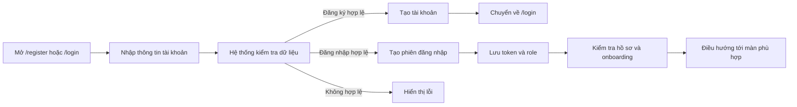

### Người dùng - 2. Quên mật khẩu

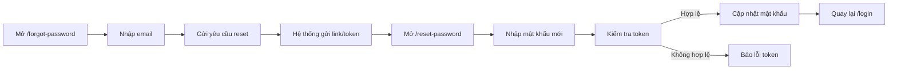

### Người dùng - 3. Hoàn thiện hồ sơ cá nhân

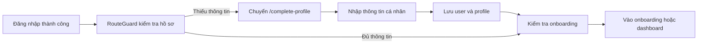

### Người dùng - 4. Onboarding định hướng ban đầu

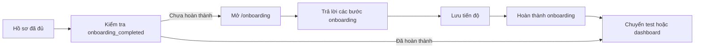

### Người dùng - 5. Làm bài test định hướng nghề nghiệp

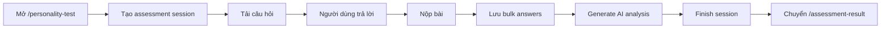

### Người dùng - 6. Xem kết quả định hướng

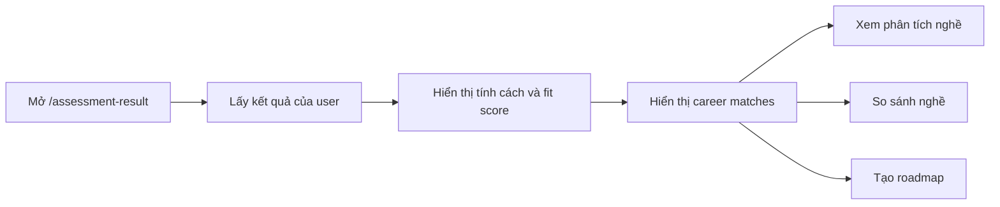

### Người dùng - 7. Khám phá nghề nghiệp

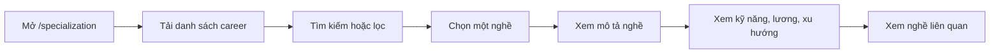

### Người dùng - 8. So sánh nghề nghiệp

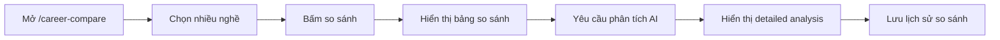

### Người dùng - 9. Tạo lộ trình học tập

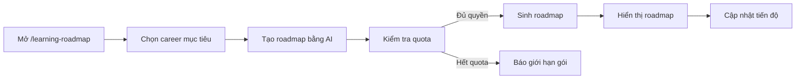

### Người dùng - 10. Mô phỏng nghề nghiệp

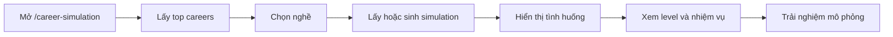

### Người dùng - 11. Tham gia cộng đồng

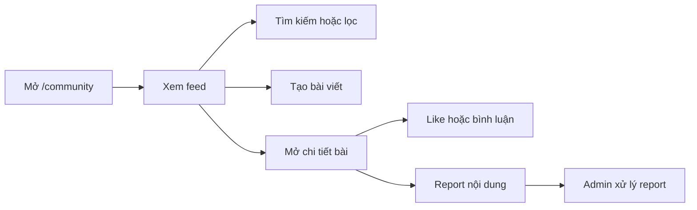

### Người dùng - 12. Tìm mentor và đặt lịch tư vấn

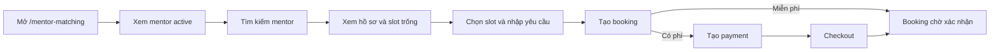

### Người dùng - 13. Quản lý ví và lịch sử thanh toán

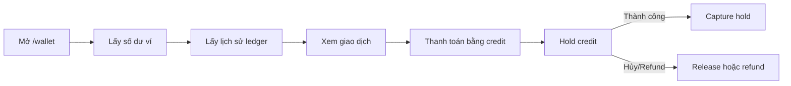

### Admin - 1. Dashboard

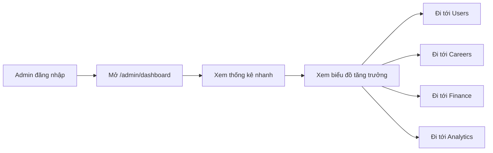

### Admin - 2. Quản lý người dùng

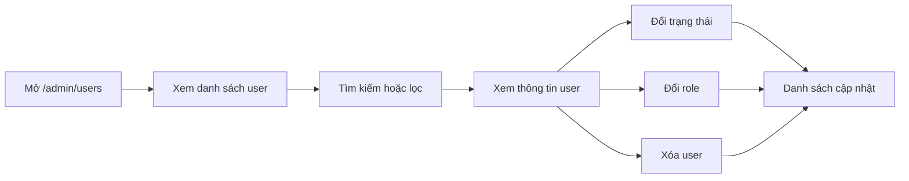

### Admin - 3. Quản lý nghề nghiệp

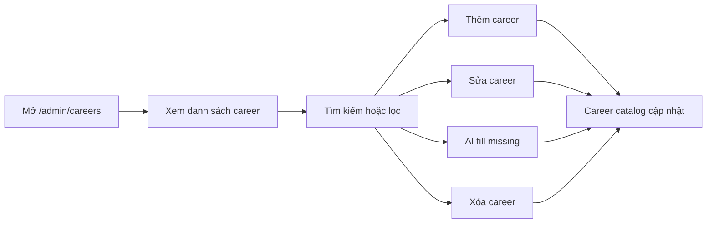

### Admin - 4. Quản lý câu hỏi assessment

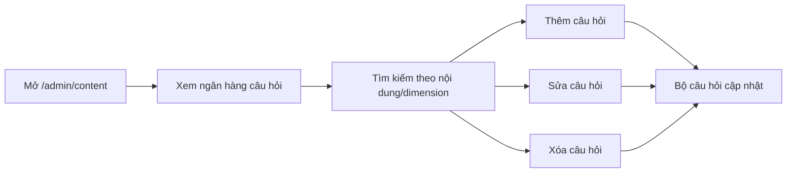

### Admin - 5. Quản lý mentor

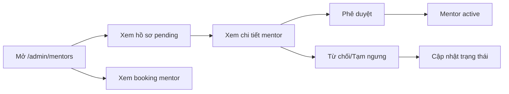

### Admin - 6. Kiểm duyệt cộng đồng

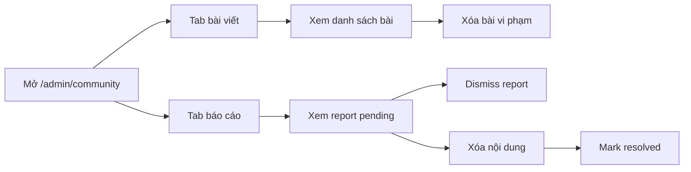

### Admin - 7. Quản lý giao dịch và tài chính

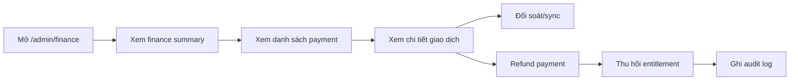

### Admin - 8. Quản lý gói AI

```mermaid
flowchart LR
  A["Mở /admin/plans"] --> B["Xem danh sách plan"]
  B --> C["Thêm plan"]
  B --> D["Sửa plan"]
  B --> E["Xóa plan"]
  B --> F["Assign plan cho user"]
  C --> G["Plan catalog cập nhật"]
  D --> G
  E --> G
  F --> H["Subscription user cập nhật"]
```

### Admin - 9. Analytics và audit logs

```mermaid
flowchart LR
  A["Mở /admin/analytics"] --> B["Xem analytics overview"]
  B --> C["Xem tracking events"]
  A --> D["Mở /admin/audit-logs"]
  D --> E["Xem activity logs"]
  E --> F["Lọc/tìm kiếm log"]
  F --> G["Điều tra hoạt động hệ thống"]
```

### Admin - 10. Cài đặt hệ thống

```mermaid
flowchart LR
  A["Mở /admin/settings"] --> B["Chọn tab cấu hình"]
  B --> C["Chỉnh thông tin hệ thống"]
  B --> D["Chỉnh thông báo"]
  B --> E["Chỉnh bảo mật/tích hợp"]
  C --> F["Lưu localStorage demo"]
  D --> F
  E --> F
```

### Mentor - 1. Xem tổng quan mentor

```mermaid
flowchart LR
  A["Mentor đăng nhập"] --> B["Mở /mentor-dashboard"]
  B --> C["Xem hồ sơ nhanh"]
  B --> D["Xem booking gần đây"]
  B --> E["Xem đánh giá"]
  C --> F["Đi tới Profile"]
  D --> G["Đi tới Bookings"]
  E --> H["Đi tới Reviews"]
```

### Mentor - 2. Đăng ký / cập nhật hồ sơ mentor

```mermaid
flowchart LR
  A["Mở hồ sơ mentor"] --> B["Nhập chuyên môn và kinh nghiệm"]
  B --> C["Nhập kỹ năng, giá, mô tả"]
  C --> D["Gửi hồ sơ"]
  D --> E["Trạng thái pending"]
  E --> F["Admin duyệt"]
  F --> G["Mentor active"]
  G --> H["Cập nhật hồ sơ khi cần"]
```

### Mentor - 3. Quản lý lịch rảnh

```mermaid
flowchart LR
  A["Mở /mentor-dashboard/availability"] --> B["Xem slot rảnh"]
  B --> C["Tạo slot"]
  B --> D["Tạo bulk slots"]
  B --> E["Sửa slot"]
  B --> F["Xóa slot"]
  C --> G["Slot hiển thị cho user"]
  D --> G
  E --> G
```

### Mentor - 4. Xác nhận lịch đặt

```mermaid
flowchart LR
  A["Mở /mentor-dashboard/bookings"] --> B["Xem booking chờ"]
  B --> C["Xem chi tiết booking"]
  C --> D["Xác nhận"]
  C --> E["Từ chối/Hủy"]
  D --> F["Thông báo user"]
  E --> F
  F --> G["Booking cập nhật trạng thái"]
```

### Mentor - 5. Nhắn tin và đổi lịch booking

```mermaid
flowchart LR
  A["Mở chi tiết booking"] --> B["Gửi tin nhắn"]
  A --> C["Tạo đề xuất đổi lịch"]
  C --> D["Người còn lại xem proposal"]
  D --> E["Accept"]
  D --> F["Decline"]
  E --> G["Cập nhật slot và booking"]
  F --> H["Giữ lịch hiện tại"]
```

### Mentor - 6. Tham gia buổi gọi mentor

```mermaid
flowchart LR
  A["Tới giờ hẹn"] --> B["Mở /mentor-call/[meetingCode]"]
  B --> C["Kiểm tra quyền tham gia"]
  C --> D["Tạo LiveKit token"]
  D --> E["Vào call room"]
  E --> F["Tư vấn với người học"]
```

### Mentor - 7. Hoàn thành booking và xem đánh giá

```mermaid
flowchart LR
  A["Buổi tư vấn kết thúc"] --> B["Đánh dấu booking completed"]
  B --> C["Yêu cầu user review"]
  C --> D["User gửi rating"]
  D --> E["Hệ thống lưu review"]
  E --> F["Mentor xem reviews"]
  F --> G["Rating mentor cập nhật"]
```

### Mobile - 1. Đăng nhập / Đăng ký

```mermaid
flowchart LR
  A["Mở mobile app"] --> B["Vào /login"]
  B --> C["Đăng nhập"]
  B --> D["Đăng ký"]
  C --> E["Lưu token"]
  D --> B
  E --> F["Vào tab home"]
```

### Mobile - 2. Admin login

```mermaid
flowchart LR
  A["Mở /admin-login"] --> B["Nhập email/mật khẩu admin"]
  B --> C["Gọi admin-login"]
  C -- "Đúng quyền" --> D["Vào app"]
  C -- "Sai quyền" --> E["Hiển thị lỗi"]
```

### Mobile - 3. Holland test

```mermaid
flowchart LR
  A["Tab home"] --> B["Bấm làm Holland test"]
  B --> C["Tạo assessment session"]
  C --> D["Tải câu hỏi"]
  D --> E["Trả lời câu hỏi"]
  E --> F["Gửi answers"]
  F --> G["Generate analysis"]
  G --> H["Mở /test-result"]
```

### Mobile - 4. Giới hạn hiện tại

```mermaid
flowchart LR
  A["Mobile hiện tại"] --> B["Có auth"]
  A --> C["Có Holland test"]
  A --> D["Có test result"]
  A --> E["Chưa có mentor/payment/community/roadmap đầy đủ"]
```

### Nền - 1. Thanh toán SePay

```mermaid
flowchart LR
  A["User mua gói hoặc booking"] --> B["Tạo payment pending"]
  B --> C["Tạo checkout token"]
  C --> D["Mở checkout"]
  D --> E["SePay xử lý"]
  E --> F["IPN về backend"]
  F --> G["Sync payment"]
  G -- "Paid" --> H["Kích hoạt quyền/booking"]
  G -- "Failed/Cancelled" --> I["Cập nhật lỗi hoặc hủy"]
```

### Nền - 2. Ví Edumee Credit

```mermaid
flowchart LR
  A["Mở /wallet"] --> B["Xem số dư"]
  B --> C["Xem ledger"]
  C --> D["Dùng credit thanh toán"]
  D --> E["Hold credit"]
  E -- "Success" --> F["Capture hold"]
  E -- "Cancel/Refund" --> G["Release hoặc refund"]
```

### Nền - 3. Thông báo

```mermaid
flowchart LR
  A["Sự kiện hệ thống"] --> B["Tạo notification"]
  B --> C["Hiển thị ở notification bell"]
  C --> D["User mở thông báo"]
  D --> E["Mark read"]
  C --> F["Mark all read"]
  B --> G["SSE stream realtime"]
```

### Nền - 4. Tracking và audit

```mermaid
flowchart LR
  A["User tương tác web"] --> B["Frontend gửi tracking event"]
  B --> C["Backend lưu analytics"]
  C --> D["Admin xem analytics"]
  E["Admin thao tác nhạy cảm"] --> F["Ghi audit log"]
  F --> G["Admin xem audit/activity logs"]
```

---

## Source tham chiếu nhanh

- Frontend routes: `fe/app/**/page.tsx`.
- Frontend views: `fe/views/*.tsx`.
- Frontend services: `fe/lib/*.service.ts`.
- Auth/session guard: `fe/context/auth-context.tsx`, `fe/components/auth/RouteGuard.tsx`.
- Backend modules: `be/src/modules/*`.
- Mobile routes: `mobile/app/*.tsx`, `mobile/app/(tabs)/*.tsx`.
- Mobile API client: `mobile/src/services/api.ts`.
