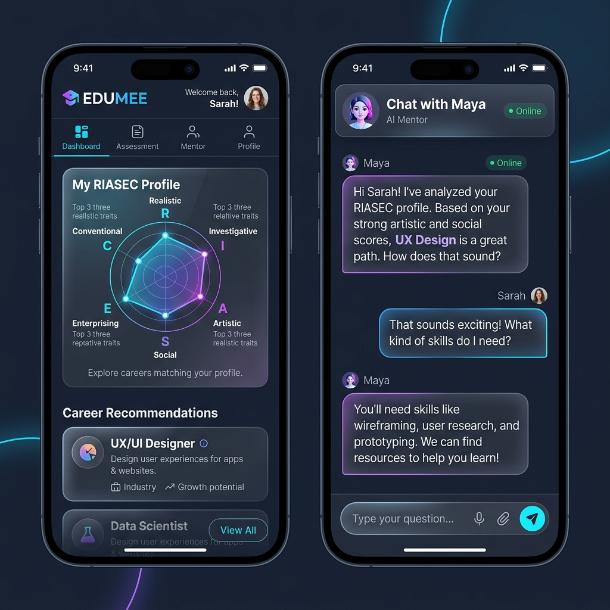
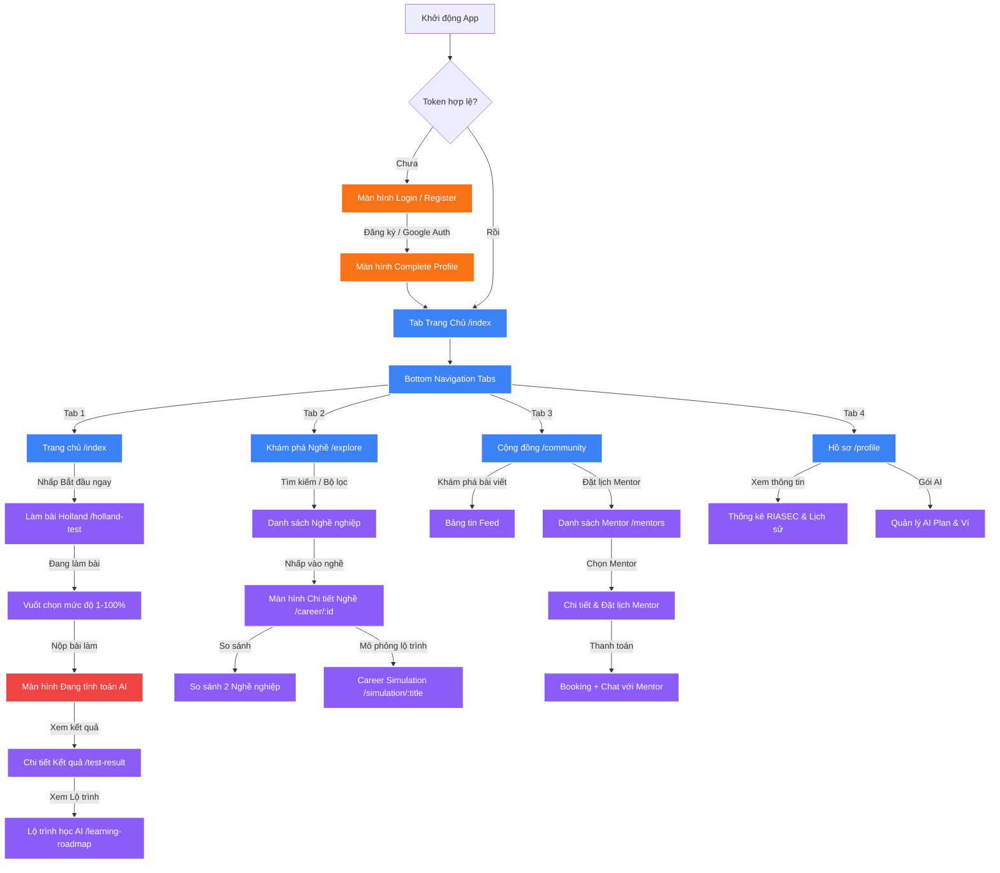

# 📱 BẢN ĐẶC TẢ LUỒNG CHỨC NĂNG & THIẾT KẾ GIAO DIỆN MOBILE DỰ ÁN EDUMEE

> **Tác giả:** Business Analyst & UI/UX Expert  
> **Dự án:** EDUMEE - Career Made For You  
> **Ngôn ngữ thiết kế:** Glassmorphism, Dark Mode Slate, Neon Accents (Xanh dương, Tím, Cam), Gen-Z Dynamic Aesthetic.

---

## 📸 1. TỔNG QUAN HÌNH ẢNH GIAO DIỆN MÔ PHỎNG (MOCKUP)

Dưới đây là thiết kế giao diện di động cao cấp (premium mockup) đã được dựng sẵn cho dự án **EDUMEE**. Giao diện sử dụng phong cách **Dark Slate Mode** thời thượng kết hợp với các hiệu ứng kính mờ (**Glassmorphic**), biểu đồ mạng nhện (**Radar Chart**) trực quan hóa tính cách RIASEC, và giao diện Chatbot AI Mentor cực kỳ hiện đại:



---

## 🎨 2. NGÔN NGỮ THIẾT KẾ & HỆ THỐNG PHONG CÁCH (VISUAL SYSTEM)

Để "WOW" người dùng trẻ tuổi (Gen Z) ngay từ cái nhìn đầu tiên, giao diện mobile được xây dựng trên một ngôn ngữ thiết kế **đậm chất tương lai (futuristic), trẻ trung, tinh tế và cực kỳ chuyên nghiệp**:

- **Gam màu chủ đạo (Color Palette):**
  - `Background` (Nền chính): `#0F172A` (Slate trầm đậm, tạo cảm giác vô cực, bảo vệ mắt và làm nổi bật các thành phần sáng).
  - `Card & Container` (Thành phần kính): `#1E293B` hoặc `rgba(30, 41, 59, 0.6)` (Kính mờ kết hợp viền mỏng sáng `rgba(148, 163, 184, 0.1)`).
  - `Primary Accent` (Xanh Neon): `#3B82F6` – Đại diện cho sự công nghệ, định hướng và trí tuệ.
  - `Secondary Accent` (Tím Neon): `#8B5CF6` – Đại diện cho sự sáng tạo và đam mê.
  - `Warm Accent` (Cam Hoàng Hôn): `#F97316` – Đại diện cho năng lượng nhiệt huyết tuổi trẻ.
- **Hiệu ứng thị giác cốt lõi:**
  - **Glassmorphism (Kính mờ):** Tận dụng component `GlassView` và thư viện `expo-blur` để tạo chiều sâu thị giác.
  - **Bento Grid Layout:** Sắp xếp trang chủ dạng ô vuông hình học không đối xứng, tạo cảm giác hiện đại giống hệ điều hành iOS cao cấp.
  - **Micro-Animations (Hoạt ảnh vi mô):** Sử dụng `react-native-reanimated` để tạo cảm giác chuyển động mượt mà khi người dùng chạm vào các ô bento hoặc vuốt thẻ câu hỏi.

---

## 🗺️ 3. SƠ ĐỒ LUỒNG ĐIỀU HƯỚNG MOBILE (NAVIGATION FLOW)

Dưới đây là sơ đồ luồng điều hướng toàn diện của ứng dụng sử dụng cấu trúc **Expo Router** thực tế trong mã nguồn:



---

## 💡 4. CHI TIẾT 5 LUỒNG CHỨC NĂNG MOBILE & ĐẶC TẢ GIAO DIỆN (UI/UX)

---

### Luồng 1: Đăng nhập Trực quan & Hoàn thiện Hồ sơ Cá nhân hóa

> Tối ưu hóa từ luồng Xác thực của Web. Lược bỏ các bước rườm rà trên di động, hỗ trợ đăng nhập nhanh bằng một chạm.

- **Luồng hoạt động (User Journey):**
  1.  Người dùng mở ứng dụng -> Màn hình đăng nhập chuyển động hạt sáng mượt mà.
  2.  Hỗ trợ **Google Sign-In nhanh** (Expo WebBrowser) hoặc Đăng nhập bằng Email/Password.
  3.  _Lần đầu đăng nhập:_ Hệ thống chuyển hướng tới màn hình **Complete Profile (Hoàn thiện hồ sơ)**. Người dùng vuốt ngang để chọn các thẻ sở thích dạng "Tag Cloud" (Công nghệ, Nghệ thuật, Kinh doanh, Số liệu...) để AI làm cơ sở gợi ý ban đầu.
- **Chi tiết Thiết kế Giao diện (UI Specification):**
  - **Nền chính:** Gradient tối từ `#0F172A` chuyển nhẹ sang `#1E1B4B` (Tím cực sâu).
  - **Form Đăng nhập:** Thiết kế thẻ nổi Glassmorphism cực kỳ tinh khiết. Trường nhập liệu có viền đổi màu sáng khi active (focus).
  - **Nút bấm:** Nút đăng nhập chính bo góc lớn (`borderRadius: 16`), sử dụng màu Gradient từ Xanh dương (`#3B82F6`) sang Tím (`#8B5CF6`), kèm hiệu ứng đổ bóng mờ ảo.
  - **Dynamic Tags:** Các nút chọn sở thích được thiết kế hình bong bóng chuyển động nhẹ nhàng khi bấm vào (sử dụng thư viện `react-native-reanimated`).

---

### Luồng 2: Trắc nghiệm Holland Tương tác Dynamic Card Deck

> Chuyển đổi từ giao diện web dạng danh sách câu hỏi nhàm chán thành trải nghiệm vuốt thẻ (Swipe Card Deck) giống Tinder vô cùng thú vị và tăng tỷ lệ hoàn thành test.

- **Luồng hoạt động (User Journey):**
  1.  Người dùng bấm nút "Bắt đầu ngay" tại Trang chủ.
  2.  Một bộ thẻ câu hỏi (mỗi thẻ là 1 câu hỏi) xuất hiện ở giữa màn hình.
  3.  Người dùng trả lời bằng cách vuốt thẻ: **Vuốt sang Phải (Thích/Phù hợp)**, **Vuốt sang Trái (Không thích/Không phù hợp)** hoặc chọn 4 thang điểm hiển thị phía dưới (Hoàn toàn đúng, Khá đúng, Ít đúng, Hoàn toàn sai).
  4.  Mỗi lần vuốt sẽ kích hoạt **haptic feedback** (rung phản hồi nhẹ trên điện thoại) và cập nhật thanh tiến trình chạy mượt phía trên.
  5.  Khi hoàn thành 100%, một hoạt ảnh phi thuyền AI bay lên cùng dòng chữ: "AI đang phân tích dữ liệu não bộ của bạn...".
- **Chi tiết Thiết kế Giao diện (UI Specification):**
  - **Thanh tiến trình:** Thanh chạy neon siêu nhỏ, tinh tế ở đỉnh màn hình.
  - **Thẻ câu hỏi:** Thẻ kính mờ bo tròn lớn (`borderRadius: 24`), có bóng mờ màu Tím nhạt phát sáng sau lưng. Chữ câu hỏi hiển thị to, rõ nét, font chữ `Plus Jakarta Sans` chuyên nghiệp.
  - **Màn hình kết quả:**
    - Hiển thị biểu đồ **Radar Chart (Mạng nhện)** vẽ bằng SVG động siêu sắc nét thể hiện 6 nhóm RIASEC (Realistic, Investigative, Artistic, Social, Enterprising, Conventional).
    - Nhóm tính cách cao nhất sẽ có card lớn mô tả chi tiết, bên cạnh là một nút kêu gọi hành động dạng nhấp nháy neon: **"Khám phá lộ trình nghề phù hợp nhất"**.

---

### Luồng 3: Khám phá Nghề nghiệp & So sánh Kéo-Thả (Drag & Drop)

> Tận dụng tối đa dữ liệu Career Database từ Web và cải tiến tính năng So sánh nghề nghiệp thân thiện với trải nghiệm vuốt chạm trên thiết bị di động.

- **Luồng hoạt động (User Journey):**
  1.  Tại Tab **Khám phá (Explore)**, người dùng được cung cấp thanh tìm kiếm thông minh tự động gợi ý cùng các bộ lọc nhanh dạng viên thuốc (Filter Pills) như: _Mức lương cao, Xu hướng AI, Phù hợp với bạn_.
  2.  **Tính năng So sánh thông minh:** Người dùng giữ nhẹ một thẻ ngành nghề bất kỳ, kéo thả vào vùng "Hộp so sánh" ở cuối màn hình. Chọn tiếp thẻ thứ hai thả vào. Hệ thống sẽ so sánh song song trực quan dưới dạng đồ họa cột.
  3.  **Chi tiết Nghề nghiệp:** Xem lộ trình phát triển (Roadmap) do AI vẽ dưới dạng bậc thang trò việc phiêu lưu, mỗi bậc là một kỹ năng cần học và các khóa học thực tế tương ứng.
- **Chi tiết Thiết kế Giao diện (UI Specification):**
  - **Thẻ danh sách nghề:** Thiết kế bo góc với hình minh họa 3D đẹp mắt (hoặc ảnh vector trừu tượng hiện đại). Hiển thị nhanh huy hiệu mức lương (Ví dụ: `15M - 35M VND`) và độ tương thích với người dùng (Ví dụ: `Match 92%`).
  - **AI Stepper Roadmap:** Thiết kế theo đường uốn lượn đứng sinh động như game đi cảnh (Adventure Path). Các chặng học tập chưa mở khóa sẽ ở trạng thái mờ xám mờ ảo, các chặng đã đạt được sẽ phát sáng neon rực rỡ kèm huy hiệu đã học xong.

---

### Luồng 4: Cộng đồng & Đặt lịch Mentor chuyên nghiệp

> Kết hợp bảng tin cộng đồng trẻ trung với hệ thống **Booking Mentor** chuyên nghiệp đã tích hợp sẵn trên Backend (API: `/tutor-profiles/active`, `/booking-sessions`, `/mentor-availability`, `/session-reviews`). Mentor được Admin duyệt, có lịch trống (Availability Slots), giá phiên và đánh giá từ học viên.

- **Luồng hoạt động (User Journey):**
  1.  Người dùng chuyển sang tab **Cộng đồng (Community)**. Phần trên hiển thị bảng tin chia sẻ, thảo luận (API: `GET /community-posts`). Phần dưới có khu vực: **"Mentor - Kết nối chuyên gia"**.
  2.  Hệ thống gọi `GET /tutor-profiles/active` hiển thị danh sách Mentor đã xác thực: _Ảnh chân dung, Chức danh, Công ty, Số năm kinh nghiệm, Kỹ năng chuyên môn, Đánh giá sao, Giá phiên_.
  3.  Người dùng bấm **"Xem profile"** để xem chi tiết Mentor (chuyên môn nghề, kỹ năng, loại phiên hỗ trợ, đánh giá học viên).
  4.  Bấm **"Đặt lịch"** → Chọn khung giờ trống từ `GET /mentor-availability/mentor/:id/available` → Điền thông tin buổi tư vấn (chủ đề, câu hỏi, mục tiêu) → Thanh toán qua SePay/Ví EDUMEE → Mentor xác nhận → Tham gia buổi tư vấn Video/Chat.
  5.  Sau buổi tư vấn, học viên đánh giá Mentor qua `POST /session-reviews`.
- **Chi tiết Thiết kế Giao diện (UI Specification):**
  - **Bảng tin Community:** Các bài viết dạng thẻ mạng xã hội thu nhỏ trẻ trung. Chạm đúp để thả tim (hiệu ứng trái tim neon). Hỗ trợ tìm kiếm, lọc theo hashtag trending (`GET /community-posts/trending-hashtags`).
  - **Danh sách Mentor:** Thẻ Mentor bo góc hiện đại, hiển thị avatar, tên, chức danh, skills dạng tag, đánh giá sao, giá phiên. Hai nút hành động: "Xem profile" và "Đặt lịch" gradient neon.
  - **Modal Đặt lịch:** Giao diện step-by-step kính mờ: Bước 1 (Chọn slot) → Bước 2 (Điền thông tin) → Bước 3 (Thanh toán). Slot trống hiển thị dạng lưới thời gian trực quan.
  - **Giao diện Chat Booking:** Hỗ trợ kính mờ ở Header, bong bóng chat Xanh dương phát sáng cho người gửi và xám kính mờ cho người nhận. Tích hợp `communicationThread` từ API.

---

### Luồng 5: Mô phỏng Lộ trình Nghề nghiệp & Hồ sơ cá nhân

> Tính năng giúp người trẻ **khám phá lộ trình thăng tiến thực tế** theo từng cấp độ sự nghiệp (API: `GET /career-simulation/top-careers`, `GET /career-simulation/:title`). Kết hợp với màn hình Hồ sơ cá nhân toàn diện (API: `GET /profiles/my-profile`, `GET /career-fit-results/my-results`, quản lý gói AI & Ví).

- **Luồng hoạt động (User Journey) - Mô phỏng:**
  1.  Từ màn hình chi tiết nghề nghiệp, người dùng bấm **"Khám phá lộ trình"**.
  2.  Hệ thống gọi `GET /career-simulation/:title` → AI tạo ra mô phỏng gồm **nhiều cấp độ thăng tiến** (VD: Fresher → Junior → Senior → Lead → Manager).
  3.  Mỗi cấp độ hiển thị: _Mức lương, Thời gian cần thiết, Nhiệm vụ hàng ngày, Lịch trình làm việc tiêu biểu, Kỹ năng cần có, Thách thức lớn nhất, Tips từ Senior_.
  4.  Người dùng vuốt ngang hoặc bấm để khám phá từng cấp độ, cảm nhận thực tế cuộc sống ở mỗi giai đoạn sự nghiệp.
- **Luồng hoạt động (User Journey) - Hồ sơ cá nhân:**
  1.  Tab **Hồ sơ (Profile)** hiển thị: Avatar, Tên, Email, Vai trò, Thông tin cá nhân.
  2.  Biểu đồ Radar RIASEC tổng hợp kết quả trắc nghiệm + danh sách nghề phù hợp.
  3.  Quản lý gói AI (Free/Plus/Business), xem quota sử dụng, lịch sử thanh toán.
  4.  Ví EDUMEE (số dư, nạp tiền) và xuất báo cáo PDF kết quả đánh giá.
- **Chi tiết Thiết kế Giao diện (UI Specification):**
  - **Simulation Timeline:** Thiết kế dạng timeline ngang với các node cấp độ, mỗi node là một thẻ gradient màu sắc khác nhau (xanh → tím → vàng). Node đang xem phát sáng neon, có emoji biểu trưng.
  - **Level Detail Card:** Thẻ lớn gradient bo tròn hiển thị 3 metric (Lương, Thời gian, Cấp tiếp). Bên dưới là danh sách nhiệm vụ và lịch trình. Hai thẻ nhỏ: "Thách thức" (đỏ) và "Tips Senior" (vàng).
  - **Profile Screen:** Bố cục sections kính mờ: Header avatar + stats → Biểu đồ RIASEC → Danh sách nghề phù hợp → Quản lý gói AI → Cài đặt. Nút đăng xuất ở cuối.

---

## 🛠️ 5. KHUNG KIẾN TRÚC MÃ NGUỒN MOBILE (EXPO ROUTER ARCHITECTURE)

Để phát triển ứng dụng di động này một cách hiệu quả và kế thừa tối đa cấu trúc có sẵn, sơ đồ phân chia thư mục đề xuất cho `mobile` như sau:

```
mobile/
├── app/                        # Expo Router Pages
│   ├── (tabs)/                 # Tab Navigation (4 tabs)
│   │   ├── _layout.tsx         # Thiết kế Bottom Tab Kính mờ (BlurView)
│   │   ├── index.tsx           # Trang chủ Bento Grid + Hero Card
│   │   ├── explore.tsx         # Khám phá Nghề nghiệp & Bộ lọc
│   │   ├── community.tsx       # Bảng tin + Danh sách Mentor Booking
│   │   └── profile.tsx         # Hồ sơ cá nhân, RIASEC, Gói AI, Ví
│   ├── career/
│   │   └── [id].tsx            # Chi tiết Nghề nghiệp & AI Roadmap
│   ├── career-compare.tsx      # So sánh 2 Nghề nghiệp song song
│   ├── simulation/
│   │   └── [title].tsx         # Mô phỏng lộ trình thăng tiến (Levels)
│   ├── mentor/
│   │   └── [id].tsx            # Chi tiết Mentor & Đặt lịch Booking
│   ├── learning-roadmap.tsx    # Lộ trình học tập AI-generated
│   ├── _layout.tsx             # Cài đặt Theme, Root Provider & Auth Guard
│   ├── login.tsx               # Màn hình Đăng nhập Neon + Google Sign-In
│   ├── register.tsx            # Màn hình Đăng ký
│   ├── complete-profile.tsx    # Chọn Tag sở thích Dynamic (Onboarding)
│   ├── holland-test.tsx        # Trắc nghiệm Swipe Card Deck
│   └── test-result.tsx         # Kết quả biểu đồ Radar SVG
│
├── src/
│   ├── components/             # Reusable UI Components
│   │   ├── GlassView.tsx       # Component kính mờ đa dụng (đã có)
│   │   ├── Button.tsx          # Nút bấm hiệu ứng Gradient (đã có)
│   │   ├── RadarChart.tsx      # Vẽ mạng nhện SVG động (tách từ test-result)
│   │   ├── SwipeCard.tsx       # Thẻ vuốt tương tác cho Holland Test
│   │   ├── MentorCard.tsx      # Thẻ hiển thị Mentor (avatar, skills, giá)
│   │   ├── CareerCard.tsx      # Thẻ nghề nghiệp (lương, match %)
│   │   ├── FilterPills.tsx     # Nút lọc dạng viên thuốc (Explore)
│   │   ├── ChatBubble.tsx      # Bong bóng chat kính mờ (Booking Chat)
│   │   └── Toast.tsx           # Thông báo đẹp thay alert() mặc định
│   ├── services/               # Port từ fe/lib/ (gần 1:1)
│   │   ├── api.ts              # Cấu hình Axios + Token interceptor (đã có)
│   │   ├── auth.service.ts     # Login, Register, Google OAuth
│   │   ├── assessment.service.ts # Câu hỏi, phiên làm bài, kết quả
│   │   ├── career.service.ts   # Danh sách nghề, chi tiết, so sánh
│   │   ├── community.service.ts # Bài viết, bình luận, like, hashtag
│   │   ├── mentor.service.ts   # Tutor profiles, booking, availability
│   │   ├── simulation.service.ts # Career simulation (top-careers, levels)
│   │   ├── roadmap.service.ts  # Learning roadmap AI-generated
│   │   ├── profile.service.ts  # Hồ sơ cá nhân, cập nhật thông tin
│   │   └── payment.service.ts  # AI billing, ví, thanh toán
│   ├── hooks/                  # Custom hooks
│   │   ├── useAuth.ts          # Quản lý token, auto-login, logout
│   │   └── useProfile.ts      # Fetch profile + career results
│   ├── types/                  # TypeScript interfaces (copy từ BE DTOs)
│   │   └── index.ts            # Career, TutorProfile, BookingSession...
│   └── theme/
│       └── index.ts            # Định nghĩa COLORS, SPACING, RADIUS (đã có)
```

---

## 🚀 6. KẾ HOẠCH BÀN GIAO & LỘ TRÌNH TRIỂN KHAI (DEVELOPER STEPS)

Dựa trên phân tích code web hiện tại (`fe/`) và backend APIs (`be/src/modules/`), lộ trình triển khai được chia thành 5 giai đoạn ưu tiên theo mức độ quan trọng cho MVP:

1.  **Giai đoạn 1 — Skeleton & Auth Guard (2 ngày):** Hoàn thiện 4 tabs trong `(tabs)/_layout.tsx`. Thêm Auth Guard ở `_layout.tsx` (kiểm tra token khi mở app, tự động vào Home nếu token hợp lệ). Tạo placeholder premium cho `explore.tsx`, `community.tsx`, `profile.tsx`. Thêm `expo-haptics` và `react-native-gesture-handler` vào dependencies.
2.  **Giai đoạn 2 — Core Screens (1 tuần):** Port services từ `fe/lib/` sang `mobile/src/services/`. Xây `explore.tsx` (danh sách nghề + search + filter pills). Xây `career/[id].tsx` (chi tiết nghề + AI roadmap). Xây `profile.tsx` (thông tin cá nhân + biểu đồ RIASEC + quản lý gói AI). Tạo `complete-profile.tsx` (onboarding tag cloud sở thích).
3.  **Giai đoạn 3 — Trắc nghiệm Nâng cấp (3-5 ngày):** Tạo component `SwipeCard.tsx` sử dụng `react-native-reanimated` + `react-native-gesture-handler`. Nâng cấp `holland-test.tsx` từ radio button sang Swipe Card Deck. Tách `RadarChart.tsx` thành component riêng với animation vẽ dần. Thêm haptic feedback (`expo-haptics`) khi vuốt.
4.  **Giai đoạn 4 — Cộng đồng & Mentor (1 tuần):** Xây bảng tin Community (posts, like, comment, hashtag trending). Xây danh sách Mentor (`MentorCard.tsx`) + Modal đặt lịch step-by-step. Tích hợp thanh toán booking. Xây Career Simulation (`simulation/[title].tsx`) hiển thị levels thăng tiến.
5.  **Giai đoạn 5 — Polish & Premium (3-5 ngày):** Thay `alert()` bằng Toast/Modal đẹp. Thêm micro-animations cho Bento Cards (fly-in). Neon glow cho progress bars. Login gradient button + Google Sign-In. Lottie animations cho loading states. Tối ưu cache bằng `@tanstack/react-query`.

> **Lưu ý:** Các tính năng Admin Panel, Mentor Dashboard, và Payment Checkout phức tạp nên ưu tiên sử dụng trên Web. Mobile chỉ cần hỗ trợ xem/đặt lịch Mentor và quản lý gói AI cơ bản.

---

_Chúc đội ngũ sáng lập EDUMEE tạo nên sự đột phá trong hành trình nâng tầm sự nghiệp thế hệ trẻ Việt Nam!_
