# TÀI LIỆU PHÂN TÍCH NGHIỆP VỤ & THIẾT KẾ KỸ THUẬT (BA & TECHNICAL DESIGN)
## TÍCH HỢP ĐĂNG NHẬP GOOGLE TRÊN MOBILE (EXPO / REACT NATIVE) ĐỒNG BỘ VỚI WEB & BACKEND

---

## 1. MỤC TIÊU & BỐI CẢNH (OBJECTIVES & CONTEXT)

### 1.1. Bối cảnh
Hệ thống **EDUMEE** hiện tại đã hoàn thiện chức năng **Đăng nhập bằng Google (Google OAuth 2.0)** trên nền tảng Web thông qua **NestJS Backend** (`be`) và **Next.js Frontend** (`fe`). Việc tích hợp tính năng tương tự trên **Mobile App (React Native/Expo)** là vô cùng cấp thiết nhằm:
*   **Tối ưu hóa Trải nghiệm Người dùng (UX)**: Giảm ma sát (friction) khi đăng ký/đăng nhập. Người dùng chỉ cần 1-click thay vì nhập form.
*   **Nhất quán Hệ sinh thái**: Đảm bảo luồng đăng nhập, xử lý cơ sở dữ liệu và đồng bộ hóa tài khoản (Avatar, Email, Name) hoạt động đồng bộ trên mọi nền tảng (Web, iOS, Android).

### 1.2. Mục tiêu của tài liệu này
Dưới vai trò là một **Chuyên gia Phân tích Nghiệp vụ (Business Analyst) kiêm Kiến trúc sư Giải pháp (Solution Architect)**, tài liệu này nghiên cứu, phân tích và đề xuất giải pháp kỹ thuật tối ưu nhất để triển khai tính năng **Google Login trên Mobile** phù hợp với hạ tầng hiện tại của EDUMEE.

---

## 2. PHÂN TÍCH LUỒNG NGHIỆP VỤ HIỆN TẠI (WEB GOOGLE FLOW ANALYSIS)

Hiện tại, hệ thống Web và Backend hoạt động theo mô hình **OAuth 2.0 Authorization Code Flow**:
1.  **Frontend (Web)** chuyển hướng người dùng đến Google Consent Screen thông qua API Backend: `GET /auth/google`.
2.  Người dùng xác thực với Google và được Google redirect về Backend callback: `GET /auth/google/callback?code=...`.
3.  **Backend NestJS** nhận `code`:
    *   Gửi yêu cầu trao đổi token với Google (`POST https://oauth2.googleapis.com/token`) lấy `access_token` và `id_token`.
    *   Lấy thông tin người dùng từ Google (`GET https://www.googleapis.com/oauth2/v3/userinfo`).
    *   Tìm kiếm hoặc tự động đăng ký tài khoản mới trong cơ sở dữ liệu MongoDB (đồng bộ avatar từ Google).
    *   Tạo ra cặp JWT Token của hệ thống (`access_token` và `refresh_token`).
4.  **Backend** redirect trình duyệt của người dùng về trang thành công của Web Frontend (`CLIENT_REDIRECT_CALLBACK`, ví dụ `http://localhost:3000/oauth-success`) kèm theo các tham số JWT Token trên Query URL.
5.  **Web Frontend** trích xuất Token từ URL, lưu vào Storage (Cookies/LocalStorage) và chuyển hướng vào Dashboard.

---

## 3. CÁC PHƯƠNG ÁN TRIỂN KHAI TRÊN MOBILE (EXPO/REACT NATIVE)

Để chuyển đổi luồng trên sang Mobile, chúng ta có **02 giải pháp tiêu chuẩn** trong hệ sinh thái Expo:

### PHƯƠNG ÁN 1: Native SDK (`@react-native-google-signin/google-signin`)
*   **Mô tả**: Sử dụng thư viện Native chính thức của Google dành cho React Native. Khi người dùng click, một Bottom Sheet/Dialog native của hệ điều hành (Android/iOS) sẽ xuất hiện cho phép chọn tài khoản Google đang có sẵn trên thiết bị.
*   **Luồng hoạt động**:
    1. Mobile App gọi thư viện SDK hiển thị Google Dialog trên thiết bị.
    2. Người dùng đồng ý, SDK trả về `idToken` trực tiếp trên thiết bị (không cần chuyển hướng trình duyệt).
    3. Mobile App gửi `idToken` này lên Backend qua một API mới: `POST /auth/google/mobile` (gửi `{ idToken }`).
    4. Backend verify `idToken` với Google, xử lý đăng ký/đăng nhập giống luồng Web và trả về JWT Tokens trực tiếp dưới dạng JSON response.

### PHƯƠNG ÁN 2: In-App Browser + Deep Linking (`expo-web-browser` & `expo-linking`)
*   **Mô tả**: Tái sử dụng luồng Authorization Code của Web. Khi người dùng click, ứng dụng sẽ mở một trình duyệt bảo mật nhỏ (In-App Browser) nằm ngay trong app để load trang đăng nhập Google.
*   **Luồng hoạt động**:
    1. Mobile App gọi `WebBrowser.openAuthSessionAsync` mở link đăng nhập của Backend: `GET /auth/google?platform=mobile`.
    2. Người dùng đăng nhập trên trình duyệt in-app này.
    3. Google redirect về Backend Callback (`/auth/google/callback`).
    4. Backend nhận dạng tham số `platform=mobile` hoặc `state=mobile`, sau đó thay vì redirect về URL Web, Backend sẽ redirect về **Deep Link của Mobile App** (ví dụ: `edumee://oauth-success?access_token=...`).
    5. Mobile App bắt được Deep Link, tự động đóng In-App Browser, lưu token và đăng nhập thành công.

---

## 4. BẢNG SO SÁNH PHƯƠNG ÁN (COMPARISON TABLE)

| Tiêu chí so sánh | Phương án 1: Native SDK | Phương án 2: In-App Browser & Deep Link |
| :--- | :--- | :--- |
| **Trải nghiệm người dùng (UX)** | ⭐⭐⭐⭐⭐ (Xuất sắc, mở dialog native mượt mà, hỗ trợ Google One Tap, không cần gõ mật khẩu lại). | ⭐⭐⭐⭐ (Khá tốt, mở một trình duyệt thu nhỏ trong app, giao diện đăng nhập Google Web). |
| **Độ phức tạp Setup Cấu hình** | **Cao**: Cần tạo SHA-1 cho Android, Plists cho iOS, tích hợp Firebase/Google Cloud, viết file `app.json` config plugin. | **Thấp**: Chỉ cần đăng ký một Deep Link duy nhất trong `app.json`. Tận dụng 100% cấu hình Google Cloud của Web hiện tại. |
| **Hỗ trợ Expo Go (Development)** | ❌ **Không**: Cần chạy lệnh `expo prebuild` và chạy trên Development Build (Simulator/Device thật) vì thư viện chứa code Native. |  **Có**: Chạy trực tiếp trên Expo Go cực kỳ nhanh chóng và tiện lợi để test luồng. |
| **Ảnh hưởng Backend** | Cần viết thêm 1 API mới: `POST /auth/google/mobile` để tiếp nhận và verify `idToken`. | 🛠️ Cực kỳ ít: Chỉ cần chỉnh sửa logic redirect ở API Callback có sẵn để hỗ trợ thêm Deep Link. |
| **Tính bảo mật** | Rất cao (Xác thực Native an toàn tối đa). | Rất cao (Sử dụng hệ thống trình duyệt hệ điều hành như `ASWebAuthenticationSession` trên iOS và `Custom Tabs` trên Android). |

### 💡 Khuyến nghị từ BA & Architect:
1.  **Giai đoạn Phát triển nhanh (Fast Delivery)**: Nên sử dụng **Phương án 2 (In-App Browser & Deep Link)** vì **Edumee đã cài sẵn `expo-web-browser` và `expo-linking`** trong `package.json`. Giải pháp này giúp team hoàn thành tính năng chỉ trong **1 ngày**, chạy thử được ngay trên Expo Go mà không phải build app native phức tạp.
2.  **Giai đoạn Production tối ưu UX**: Về lâu dài, khi ứng dụng chuẩn bị publish lên App Store/Google Play, team có thể bổ sung thêm **Phương án 1 (Native SDK)** để đạt trải nghiệm mượt mà cao nhất.

---

## 5. THIẾT KẾ KIẾN TRÚC & SƠ ĐỒ TUẦN TỰ (SEQUENCE DIAGRAM)

### Luồng Hoạt động Chi tiết của Phương án 2 (In-App Browser + Deep Link)

Dưới đây là sơ đồ Mermaid mô tả dòng chảy dữ liệu từ khi người dùng click nút "Google" trên điện thoại cho đến khi đăng nhập thành công:

```mermaid
sequenceDiagram
    autonumber
    actor User as Người dùng Mobile
    participant Mobile as Mobile App (Expo Router)
    participant Browser as In-App Browser (WebBrowser)
    participant BE as Backend (NestJS)
    participant Google as Google OAuth Server
    participant DB as MongoDB

    User->>Mobile: Click nút "Đăng nhập bằng Google"
    Note over Mobile: Tạo Deep Link callback để nhận token<br/>(Ví dụ: edumee://oauth-success)
    Mobile->>Browser: Mở In-App Browser với URL:<br/>BE_URL/auth/google?state=mobile
    Browser->>BE: GET /auth/google?state=mobile
    BE->>Browser: Redirect đến Google Consent Screen (kèm state=mobile)
    Browser->>Google: Đăng nhập & Xác thực tài khoản Google
    Google->>Browser: Redirect về Backend Callback kèm Code & State:<br/>BE_URL/auth/google/callback?code=xxx&state=mobile
    Browser->>BE: GET /auth/google/callback?code=xxx&state=mobile
    
    rect rgb(20, 30, 45)
        Note over BE: Xử lý trao đổi Token & Lấy User Info
        BE->>Google: POST /oauth2/v3/token (code)
        Google-->>BE: Trả về access_token & id_token
        BE->>Google: GET /userinfo (access_token)
        Google-->>BE: Trả về Email, Name, Picture
    end

    rect rgb(25, 45, 25)
        Note over BE: Xử lý Database & Hệ thống
        BE->>DB: Tìm hoặc Tạo User theo Email (đồng bộ Avatar)
        DB-->>BE: Trả về đối tượng User
        Note over BE: Tạo hệ thống JWT Tokens (access_token & refresh_token)
    end

    BE-->>Browser: Redirect về Deep Link của Mobile (được kích hoạt bởi state=mobile):<br/>edumee://oauth-success?access_token=xxx&refresh_token=yyy
    Note over Browser: Trình duyệt nhận deep link 'edumee://'<br/>Hệ điều hành kích hoạt và chuyển hướng về Mobile App
    Browser-->>Mobile: Đóng In-App Browser & Trả dữ liệu URL Deep Link
    
    Note over Mobile: Parse access_token & refresh_token từ URL<br/>Lưu vào SecureStore (expo-secure-store)
    Mobile->>User: Đăng nhập thành công, chuyển hướng vào màn hình Dashboard (tabs)
```



---

## 6. CHI TIẾT KẾ HOẠCH TRIỂN KHAI PHẦN CỨNG & PHẦN MỀM (IMPLEMENTATION STEPS)

### BƯỚC 1: CẤU HÌNH MOBILE DEEP LINK (`mobile/app.json`)
Để điện thoại có thể hiểu được đường dẫn `edumee://`, chúng ta cần khai báo một trường `scheme` trong cấu hình Expo:

```json
{
  "expo": {
    "name": "mobile",
    "slug": "mobile",
    "scheme": "edumee",
    "...": "..."
  }
}
```

### BƯỚC 2: CẬP NHẬT BACKEND NESTJS (`be`)

#### 2.1. Cập nhật `auth.service.ts` để hỗ trợ nhận `state` từ Client
Chúng ta sẽ sửa đổi hàm khởi tạo URL Google để đính kèm thêm tham số `state` (nhằm phân biệt luồng Mobile hay Web):

```typescript
// Trong be/src/modules/auth/auth.service.ts

getGoogleAuthorizationUrl(state?: string): string {
  const query = new URLSearchParams({
    client_id: this.configService.get<string>('GOOGLE_CLIENT_ID') || '',
    redirect_uri: this.configService.get<string>('GOOGLE_CALLBACK_URL') || '',
    response_type: 'code',
    scope: 'openid email profile',
    access_type: 'offline',
    prompt: 'consent',
    include_granted_scopes: 'true',
    ...(state ? { state } : {}), // Đính kèm state nếu có
  });

  return `https://accounts.google.com/o/oauth2/v2/auth?${query.toString()}`;
}
```

#### 2.2. Cập nhật `auth.controller.ts` để xử lý Redirect thông minh
Chỉnh sửa Endpoint `@Get('google')` và `@Get('google/callback')` để điều hướng linh hoạt:

```typescript
// Trong be/src/modules/auth/auth.controller.ts

  @ApiOperation({ summary: 'Khởi tạo đăng nhập Google OAuth' })
  @Get('google')
  @Redirect()
  googleAuth(@Query('state') state?: string) {
    // Truyền state (ví dụ: 'mobile' hoặc 'web') vào Google Auth
    return { url: this.authService.getGoogleAuthorizationUrl(state) };
  }

  @ApiOperation({
    summary: 'Google OAuth Callback (Được tự động gọi bởi Google)',
  })
  @Get('google/callback')
  @Redirect()
  async googleAuthCallback(
    @Query('code') code: string,
    @Query('state') state?: string, // Nhận lại state từ Google gửi về
  ) {
    if (!code) {
      const defaultWebUrl = this.configService.get<string>('CLIENT_REDIRECT_CALLBACK') || 'http://localhost:3000/oauth-success';
      const redirectErrorUrl = state === 'mobile' ? 'edumee://oauth-success?error=missing_code' : `${defaultWebUrl}?error=missing_code`;
      return { url: redirectErrorUrl };
    }

    const result = await this.authService.googleLogin(code);

    // Xác định Frontend chuyển hướng dựa trên state
    let targetRedirectUrl: string;

    if (state === 'mobile') {
      // Nếu là luồng Mobile, redirect qua Deep Link
      targetRedirectUrl = `edumee://oauth-success?access_token=${encodeURIComponent(result.access_token)}&refresh_token=${encodeURIComponent(result.refresh_token)}&role=${encodeURIComponent(result.role)}&new_user=${result.new_user}`;
    } else {
      // Nếu là luồng Web thông thường
      const frontendWebUrl = this.configService.get<string>('CLIENT_REDIRECT_CALLBACK') || 'http://localhost:3000/oauth-success';
      targetRedirectUrl = `${frontendWebUrl}?access_token=${encodeURIComponent(result.access_token)}&refresh_token=${encodeURIComponent(result.refresh_token)}&role=${encodeURIComponent(result.role)}&new_user=${result.new_user}`;
    }

    return { url: targetRedirectUrl };
  }
```

### BƯỚC 3: CẬP NHẬT MOBILE APP (`mobile`)

#### 3.1. Viết Hàm Xử lý Đăng Nhập Google trong `mobile/app/login.tsx`
Chúng ta sẽ import các thư viện và thiết lập xử lý tương tác mở browser:

```typescript
import * as WebBrowser from 'expo-web-browser';
import * as Linking from 'expo-linking';
import { api, setAuthToken } from '../src/services/api';

// Bắt buộc khai báo để hoàn tất luồng WebBrowser trên mobile
WebBrowser.maybeCompleteAuthSession();

// Trong component LoginScreen:
const handleGoogleLogin = async () => {
  setIsLoading(true);
  try {
    // 1. Tạo deep link redirect cho app của chúng ta
    const redirectUrl = Linking.createURL('oauth-success');
    console.log('Mobile Deep Link Callback:', redirectUrl);

    // 2. Điểm nối API Backend Edumee khởi tạo Google Auth
    const backendAuthUrl = `${api.defaults.baseURL}/auth/google?state=mobile`;
    console.log('Opening Backend Google Auth URL:', backendAuthUrl);

    // 3. Mở trình duyệt in-app
    const authResult = await WebBrowser.openAuthSessionAsync(backendAuthUrl, redirectUrl);

    if (authResult.type === 'success' && authResult.url) {
      // 4. Trình duyệt đóng và redirect trả link về ứng dụng khách
      const parsedUrl = Linking.parse(authResult.url);
      const { access_token, refresh_token } = parsedUrl.queryParams as {
        access_token?: string;
        refresh_token?: string;
      };

      if (access_token) {
        // Lưu token vào SecureStore / HTTP client state
        await setAuthToken(access_token);
        
        // Điều hướng người dùng vào Dashboard chính
        router.replace('/(tabs)');
        Platform.OS === 'web' 
          ? alert('Đăng nhập Google thành công!') 
          : Alert.alert('Thành công', 'Đăng nhập Google thành công!');
      } else {
        throw new Error('Không lấy được token từ Google.');
      }
    } else {
      console.log('User cancelled or browser closed. Result status:', authResult.type);
    }
  } catch (error: any) {
    console.error('Google Login Error:', error);
    const msg = error.message || 'Có lỗi xảy ra trong quá trình đăng nhập bằng Google';
    Platform.OS === 'web' ? alert(msg) : Alert.alert('Lỗi', msg);
  } finally {
    setIsLoading(false);
  }
};
```

---

## 7. THIẾT KẾ GIAO DIỆN PREMIUM (UI/UX SPECIFICATION)

Để đảm bảo yếu tố **Aesthetics** vượt trội chuẩn 5 sao, thu hút người dùng từ cái nhìn đầu tiên như hệ thống Web Glassmorphism hiện tại của Edumee, nút "Google Login" cần được thiết kế với giao diện cao cấp:

### 7.1. Đặc tả UI
*   **Vị trí**: Nằm bên dưới nút "Đăng nhập" truyền thống, ngăn cách bởi đường kẻ ngang thanh lịch kèm text "Hoặc đăng nhập bằng".
*   **Aesthetics (Độ thẩm mỹ)**:
    *   **Nền**: Bán trong suốt dạng **Glassmorphism** (`rgba(255, 255, 255, 0.08)`) bo viền mịn và mỏng sắc nét `borderColor: 'rgba(255, 255, 255, 0.15)'`.
    *   **Hiệu ứng Hover/Pressed**: Phản hồi chuyển động mượt mà (chuyển nhẹ sang `rgba(255, 255, 255, 0.15)` khi click).
    *   **Icon**: Sử dụng logo Google đa màu nguyên bản chất lượng cao hoặc vector rõ nét.
    *   **Chữ**: "Tiếp tục với Google" sử dụng font chữ `PlusJakartaSans_600SemiBold` phối màu trắng ngọc tinh khiết (`COLORS.foreground`).

### 7.2. Code UI Button Tích hợp (Tương thích hoàn toàn với file `login.tsx` hiện tại)

```tsx
{/* Thêm phần ngăn cách tinh tế */}
<View style={styles.dividerContainer}>
  <View style={styles.dividerLine} />
  <Text style={styles.dividerText}>Hoặc đăng nhập bằng</Text>
  <View style={styles.dividerLine} />
</View>

{/* Nút đăng nhập Google Glassmorphism Premium */}
<Pressable 
  onPress={handleGoogleLogin}
  disabled={isLoading}
  style={({ pressed }) => [
    styles.googleButton,
    { backgroundColor: pressed ? 'rgba(255, 255, 255, 0.15)' : 'rgba(255, 255, 255, 0.07)' }
  ]}
>
  {isLoading ? (
    <ActivityIndicator color={COLORS.foreground} />
  ) : (
    <View style={styles.googleButtonContent}>
      {/* Vẽ Icon Google SVG màu chuẩn */}
      <Svg width="20" height="20" viewBox="0 0 24 24" style={{ marginRight: 12 }}>
        <Path
          fill="#EA4335"
          d="M12.24 10.285V14.4h6.887c-.648 2.41-2.519 4.114-5.136 4.114A5.79 5.79 0 0 1 8.2 12.725a5.79 5.79 0 0 1 5.79-5.79 5.71 5.71 0 0 1 3.93 1.547l3.1-3.1A9.94 9.94 0 0 0 13.99 2.14c-5.5 0-9.96 4.46-9.96 9.96s4.46 9.96 9.96 9.96c5.77 0 9.8-4.06 9.8-9.96 0-.67-.06-1.3-.17-1.815H12.24Z"
        />
        <Path
          fill="#4285F4"
          d="M23.62 12.285c0-.67-.06-1.3-.17-1.815H12.24V14.4h6.887c-.28 1.05-.9 1.94-1.75 2.51v3.29h2.72a9.92 9.92 0 0 0 3.52-7.915Z"
        />
        <Path
          fill="#34A853"
          d="M13.99 22.06c2.7 0 4.96-.89 6.62-2.42l-3.22-2.51c-.9.6-2.06.96-3.4.96-2.617 0-4.828-1.764-5.617-4.135l-3.32 2.57A9.95 9.95 0 0 0 13.99 22.06Z"
        />
        <Path
          fill="#FBBC05"
          d="M8.373 13.955a5.9 5.9 0 0 1-.307-1.83c0-.64.11-1.26.307-1.83l-3.32-2.57a9.93 9.93 0 0 0 0 8.8l3.32-2.57Z"
        />
      </Svg>
      <Text style={styles.googleButtonText}>Tiếp tục với Google</Text>
    </View>
  )}
</Pressable>
```

Vài khai báo Styles tương thích hoàn hảo:

```typescript
// Bổ sung vào StyleSheet:
  dividerContainer: {
    flexDirection: 'row',
    alignItems: 'center',
    marginVertical: SPACING.lg,
  },
  dividerLine: {
    flex: 1,
    height: 1,
    backgroundColor: 'rgba(255, 255, 255, 0.1)',
  },
  dividerText: {
    color: COLORS.muted,
    paddingHorizontal: SPACING.md,
    fontSize: 13,
  },
  googleButton: {
    height: 56,
    borderRadius: RADIUS.lg,
    borderWidth: 1,
    borderColor: 'rgba(255, 255, 255, 0.12)',
    justifyContent: 'center',
    alignItems: 'center',
    marginTop: SPACING.xs,
  },
  googleButtonContent: {
    flexDirection: 'row',
    alignItems: 'center',
    justifyContent: 'center',
  },
  googleButtonText: {
    color: COLORS.foreground,
    fontSize: 16,
    fontWeight: '600',
    letterSpacing: 0.3,
  },
```

---

## 8. KẾT LUẬN & HƯỚNG ĐI TIẾP THEO

Tài liệu này đã giải quyết triệt để khía cạnh BA và định hướng giải pháp kỹ thuật cụ thể. 
Với **Phương án 2 (In-App Browser & Deep Link)**, team có thể triển khai ngay lập tức:
1.  **Về phía Backend**: Cập nhật hàm `googleAuthCallback` để phát hiện `state === 'mobile'` và trả về Deep Link thay vì Web URL.
2.  **Về phía Mobile**:
    *   Thêm `scheme: "edumee"` vào file `app.json`.
    *   Tích hợp nút đăng nhập Google Glassmorphism và hàm xử lý `handleGoogleLogin` sử dụng `expo-web-browser` vào màn hình `login.tsx`.

Sự kết hợp này vừa tối đa hóa khả năng tái sử dụng code có sẵn của Web vừa mang lại trải nghiệm mượt mà, đồng thời giúp bạn kiểm thử dự án cực kỳ dễ dàng trực tiếp thông qua **Expo Go** trên mọi dòng điện thoại.
